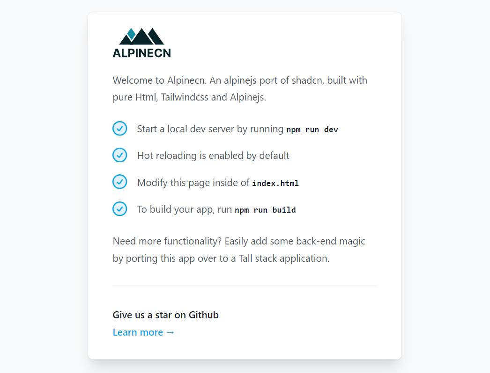

# Alpinecn

[Alpinecn](https://alpinecn.com) is an [Alpinejs](https://alpinejs.dev) port of [Shadcn ui](https://ui.shadcn.com/), built with pure Html, [Tailwindcss](https://tailwindcss.com) and Alpinejs.

```bash
git clone https://github.com/alpinecn/alpinecn.git
```



## Installation

Install and get running with the following commands:

```bash
git clone https://github.com/alpinecn/alpinecn.git
cd alpinecn
npm run dev
```

## Hot Reloading

You can update the directory or file type that you want the watcher to look for inside of the **handleHotUpdate** method inside of **alpine-vite-plugin.js**.

## Building for production

If you want to distribute this application, you can run:

```
npm run build
```

And your application will be built inside of the `/dist` folder.

## Contributing

Pull requests are welcome. For major changes, please open an issue first
to discuss what you would like to change.

## License

[MIT](https://choosealicense.com/licenses/mit/)
